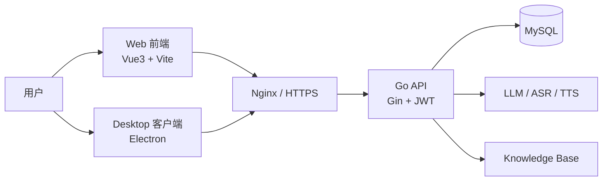

<div align="center">
  

  # AI Interview Pro

  ### 🤖 面向真实求职场景的 AI 面试与能力提升平台

  <p>
    <a href="./README.zh-CN.md">旧版中文说明</a> ·
    <a href="./README-zh-CN.md">历史文档</a>
  </p>
</div>

<div align="center">


</div>

## ✨ 一句话简介

**AI Interview Pro** 是一个支持 **Web + Electron 桌面端** 的全栈智能面试系统，集成 AI 追问、语音转写、面试报告、成长分析与多角色协作（学生 / 企业 / 高校），并可通过 Docker 在服务器快速部署。

## 🚀 核心特性

- 🧩 **多端一致体验**：同一套业务能力同时支持 Web 与桌面端。
- 🎙️ **真实对话式面试**：支持语音作答、实时追问、评分与改进建议。
- 🧠 **多模型能力编排**：LLM/ASR/TTS 可配置，便于扩展与替换。
- 🧑‍💼 **多角色系统**：学生训练、企业招聘、高校就业支持一体化。
- 📊 **闭环成长反馈**：报告、历史记录、能力趋势持续追踪。
- 🛠️ **工程化落地**：支持 Docker Compose 一键部署与 Electron 安装包分发。

## 🖼️ 演示截图


## 🏗️ 技术栈与架构

### Tech Stack

| 层级 | 方案 |
| --- | --- |
| 前端 Web | Vue 3 + Vite + Pinia + Vue Router + Element Plus |
| 桌面端 | Electron + vite-plugin-electron + electron-builder |
| 后端 | Go + Gin + GORM + JWT |
| 数据层 | MySQL 8 |
| AI 能力 | LLM 抽象层 + Whisper 兼容 ASR + TTS + OCR |
| 部署 | Docker Compose + Nginx + 可选 Coturn |

### 架构图



## ⚡ 快速开始（傻瓜式）

### 0) 环境准备

- Node.js 18+
- Go 1.25+
- Docker + Docker Compose

### 1) 运行 Web 端（开发）

```bash
cd web
npm install
npm run dev:web
```

默认会启动 Vite 开发服务，打开终端提示地址即可访问。

### 2) 运行 Electron 客户端（开发）

```bash
cd web
npm install
npm run dev:desktop
```

### 3) 打包 Electron 客户端（Windows .exe）

```bash
cd web
npm run dist:win
```

产物目录：`web/release/`

### 4) Docker Compose 一键启动服务端（推荐部署方式）

```bash
cp .env.example .env
docker compose up -d --build
```

Windows PowerShell：

```powershell
Copy-Item .env.example .env
docker compose up -d --build
```

常用排查命令：

```bash
docker compose ps
docker compose logs -f backend
docker compose logs -f frontend
```

## 📦 客户端下载

请前往本仓库 **GitHub Releases** 下载最新桌面安装包（`.exe`）：

👉 `https://github.com/<YOUR_ORG>/<YOUR_REPO>/releases`

> 建议发布时同时上传：安装包、`latest.yml`、`.blockmap`，以支持自动更新。

## 📁 项目结构（精简）

```text
.
├─ server/                # Go 后端服务
├─ web/                   # Vue + Electron 前端
├─ knowledge_base/        # 知识库与提示词
├─ docker-compose.yml     # 一键部署编排
└─ README.md
```

## 🤝 团队与致谢

- 团队：`我们叫什么队`
- 感谢：所有贡献者、测试同学与开源社区。

---

如果你觉得这个项目对你有帮助，欢迎点个 ⭐ Star 支持一下！
